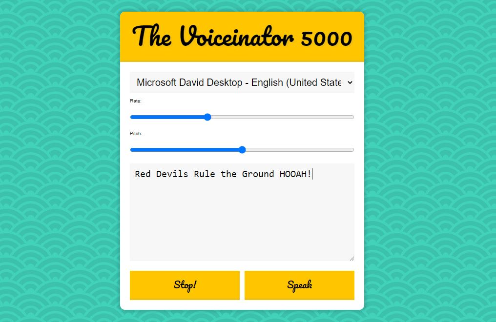

# voiceinator5000

This is project 23 in Wes Bos' JavaScript 30 course.  In this lesson we built a text to speach program which takes the text in a textarea and speaks it out loud using the browser and OS' speech synthesis.  Once we were able to get the program speaking, we then played around with the speech play rate and the speech pitch as well as the different voice options available. 

This was a really fun project to make and if you're interested in doing it yourself, you can find the video <a href="https://www.youtube.com/watch?v=saCpKH_xdgs">here.</a>

